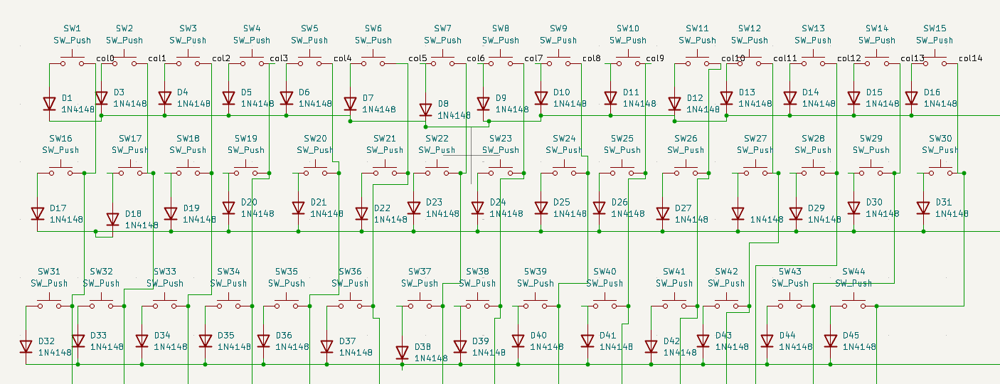
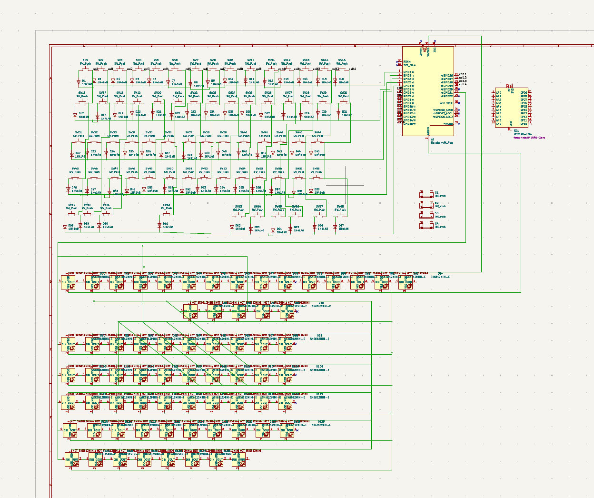
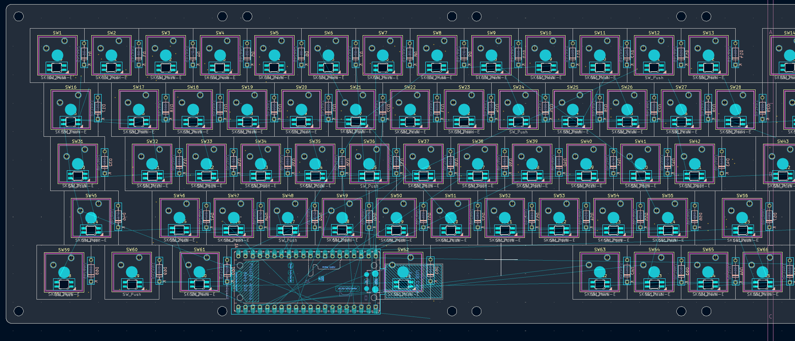
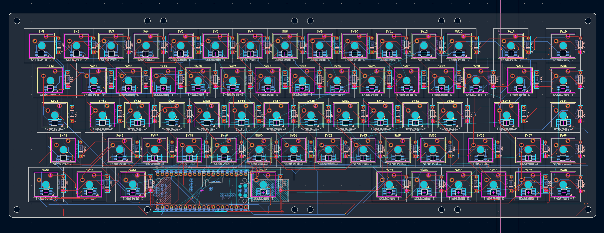

Finally understood how a matrix work and connecting the first switches 

Yes! After so many hours of work i finished the schematic but i am still not sure what microcontroller i need to use, i'll figure out later

My attempt to place all the keys an other component was succesful, now it comes the wiring

PCB almost finished! It took a lot of time because the connections are A LOT. Now there are only few of them i still need to connect

