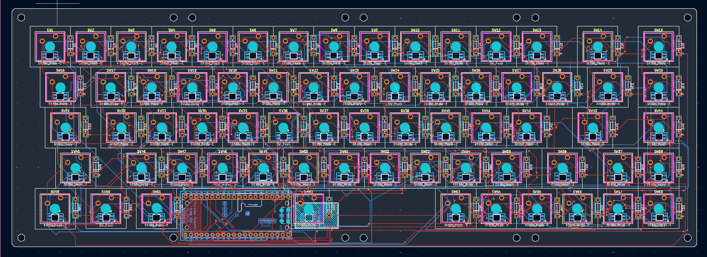
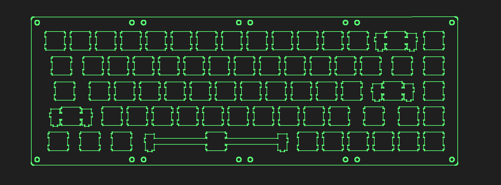
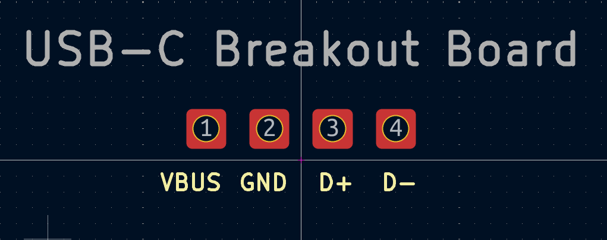

Finally understood how a matrix work and connecting the first switches 

Yes! After so many hours of work i finished the schematic but i am still not sure what microcontroller i need to use, i'll figure out later

My attempt to place all the keys an other component was succesful, now it comes the wiring

PCB almost finished! It took a lot of time because the connections are A LOT. Now there are only few of them i still need to connect

PCB Finalyy finished! Now i only need to tidy the connections and check the DRC. If it comes OK I can finally commit the diagram and PCB!

PCB officially uploaded. Now it comes the case design

Started designign the plate, than it comes the case! 

Update:
I ran into a problem, i just realized that it isn't possible to connect the usb to the keybaord because the microcontroller is sitting right under the spacebar. A possible solution is to have a usb female-female inside the case to re-route that port to a nicer spot (probably in the front of the case)

Solution:
I searched up on the internet and i found this board https://www.adafruit.com/product/4090?hl=en-US&utm_source=chatgpt.com (Adafruit USB Type C Breakout Board) so my plan is to screw this into the case and then connect it into the PCB. Soon after i discovered that were 0 footprints about this board so i decided to create my own, with the basic pins with simple thru-hole and later I will use some jumper wires to connect it so i have more flexibility on where to put this board

