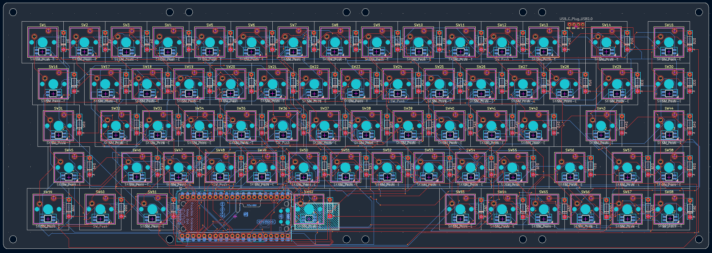

Just a custom mechanical keyboard project designed by me

## Specs

- **Layout:** 68 keys, 15 columns x 5 rows matrix, ANSI 65% (up arrow between right Shift and Delete, left/down/right arrows on the bottom row, Fn next to AltGr)
- **Microcontroller:** Raspberry Pi Pico (RP2040), mounted under the spacebar
- **LEDs:** SK6812MINI-E, one per key, same color across the whole board
- **Matrix diodes:** 1N4148, one per switch
- **USB:** routed from the microcontroller (under the spacebar) up to the connector at the top of the case via a Treedix USB-C breakout

## Why the Pico and not something smaller

Originally I was going for something more compact (Orpheus Pico, then XIAO RP2040, then RP2040-Zero) because the standard Pico seemed too bulky to fit between the switches. That problem went away once I moved the microcontroller under the spacebar, where there's way more free space, at that point the regular Pico made more sense, i had space to place it and it has enough pins to fit evry component.

## Matrix

- Rows: GPIO0-GPIO4
- Columns: GPIO5-GPIO19
- Every switch has its own diode to prevent ghosting

## LEDs

Driven via PIO on GPIO21.

LED power comes straight from VBUS (5V), not from the Pico's 3.3V regulator, so the current spikes from 68 LEDs at once don't stress it. Max brightness needs to stay capped in firmware.

## USB

The Pico sits under the spacebar, away from the case edge where the connector needs to come out. D+/D- are hand-wired to test points TP2/TP3 on the back of the Pico (not routed through the PCB), going to a Treedix USB-C breakout mounted in the case. CC1/CC2 on the breakout already have pull-down resistors built in, so they're left unconnected.

## Plate

The plate and the case are fully 3d printed

## Firmware

Live control from a PC over Raw HID (`tastiera68_controller.py`, requires `pip install hidapi`):
- change LED color on the fly (persistent, saved to the Pico's emulated EEPROM)
- remap any key without reflashing (also persistent, saved to a dedicated EEPROM area)

## Building the firmware

### 1. Get QMK

If you don't already have a QMK checkout:

```
git clone https://github.com/qmk/qmk_firmware.git
cd qmk_firmware
```

Follow QMK's own setup guide once (https://docs.qmk.fm/#/newbs_getting_started)
to install the build environment (Python, the ARM toolchain, etc.) if you
haven't done that before — it's a one-time setup per PC.

### 2. Drop this keyboard into the QMK tree

Copy the whole `HexKey60` folder into `qmk_firmware/keyboards/`, so you end
up with:

```
qmk_firmware/
  keyboards/
    HexKey60/
      info.json
      keymaps/
        default/
          keymap.c
          rules.mk
```

### 3. Compile

From the `qmk_firmware` root:

```
qmk compile -kb HexKey60 -km default
```

If everything is set up correctly this produces a file called something
like `HexKey60_default.uf2` in the `qmk_firmware` root folder.

If the build fails on the EEPROM driver lines in `rules.mk`
(`EEPROM_DRIVER` / `WEAR_LEVELING_DRIVER`), check QMK's current docs for the
exact driver name used for RP2040 in your checkout's version — the name has
changed between QMK releases.

### 4. Put the Pico into bootloader mode

The RP2040 shows up as a USB mass-storage drive (`RPI-RP2`) when it's ready
to receive new firmware:

1. Unplug the keyboard.
2. Hold down the **BOOTSEL** button on the Pico (the small white button on
   the board itself).
3. While still holding it, plug the USB cable back in.
4. Let go of the button — a drive called `RPI-RP2` should appear on your
   computer, the same way a USB flash drive would.

### 5. Flash

Just drag and drop the `.uf2` file you built in step 3 onto the `RPI-RP2`
drive. The Pico reboots on its own as soon as the copy finishes, and the
keyboard should now be running your firmware.

If `qmk flash` is set up on your system instead, this also works and does
the copy for you:

```
qmk flash -kb HexKey60 -km default
```
